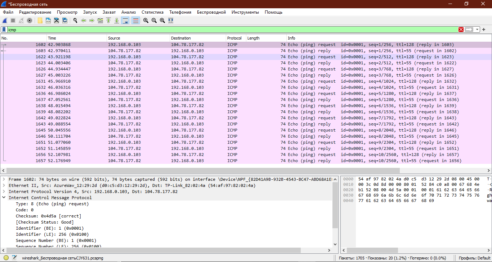
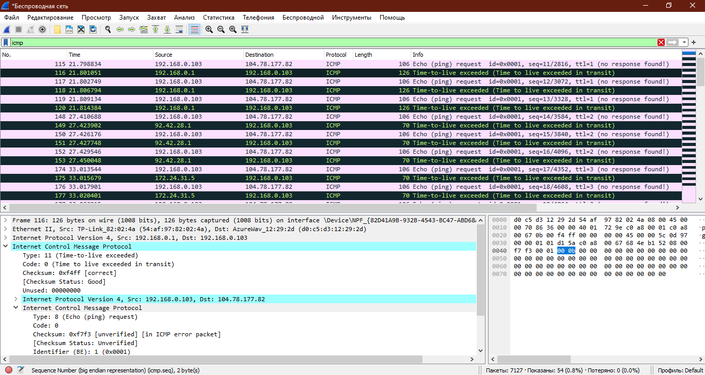
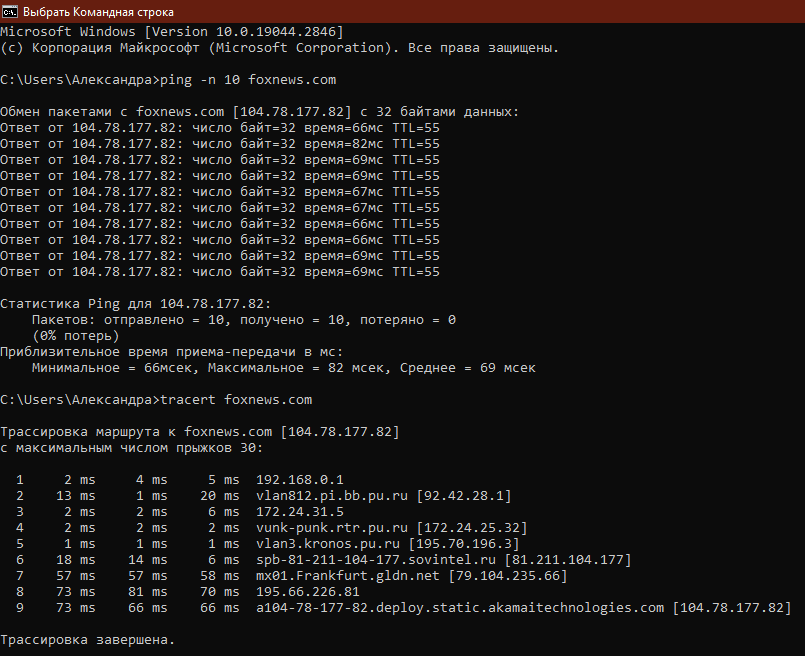

## Homework 9. ***Сетевой уровень***

## 1. Wireshark: ICMP

### 1. Ping

1. IP-адрес моего хоста: 192.168.0.103

    IP-адрес хоста назначения: 104.78.177.82

2. Номера исходного и конечного портов используются на транспортном уровне. ICMP относиться к сетевому уровню (т.к. является частью протокола IP) и используется для эхо-запросов между хостами.
3. Тип - эхо-запрос с номером 8 (Type: 8 (Echo (ping) request)).

    Также есть контрольная сумма, её статус, идентификаторы, порядковый номер:
    
    Checksum: 0x4d5a [correct]
    
    [Checksum Status: Good]
    
    Identifier (BE): 1 (0x0001)
    
    Identifier (LE): 256 (0x0100)
    
    Sequence Number (BE): 1 (0x0001)
    
    Sequence Number (LE): 256 (0x0100)

    На каждое поле приходится по 2 байта.

4. Аналогично:

    Тип - эхо-ответ с номером 0 (Type: 0 (Echo (ping) reply)).

    Также есть контрольная сумма, её статус, идентификаторы, порядковый номер:
    
    Checksum: 0x555a [correct]
    
    [Checksum Status: Good]
    
    Identifier (BE): 1 (0x0001)
    
    Identifier (LE): 256 (0x0100)
    
    Sequence Number (BE): 1 (0x0001)
    
    Sequence Number (LE): 256 (0x0100)

    На каждое поле также приходится по 2 байта.

### 2. Traceroute

1. В первых запросах не посылается response frame [No response seen], в предыдущем задании говорил куда отвечать (reply 1623).
2. В дополнительных полях появляется запрос типа - Type: 11 (Time-to-live exceeded), и некоторая информация о нем:

    Code: 0 (Time to live exceeded in transit)

    Checksum: 0xf4ff [correct]

    [Checksum Status: Good]

3. Рассмотрите три последних ICMP-пакета, полученных исходным хостом. Чем эти пакеты
отличаются от ICMP-пакетов, сообщающих об ошибках? Чем объясняются такие отличия?

    Нет дополнительных полей, есть время ответа [Response time: 65,818 ms] и ответный фрейм [Request frame: 6674].

    Предполагаю, что в ICMP-пакете с ошибкой также передаётся информация о самой ошибке (Time-to-live exceeded) (срок службы пакета превысил количество переходов и был отброшен).

4. 104 (думала, что в Америке, но больше похоже на Европу). Наибольшая задержка на 195.66.226.81 - похоже на русский.

    

## 3. Задачи. Работа протокола TCP

### Задача 1

1. Частота потерь $\ { L }$ - отношение количества потерянных пакетов к количеству отправленных.

    Количество отправленных за цикл пакетов:

    $$\ W/2 + (W/2 + 1) + L + W = $$

    $$\ = W/2 * (W/2 + 1) + 1/2 * (W/2 * (W/2 + 1)) = $$

    $$\ = W^2 / 4 + W^2 / 8 + W / 4 + W / 2 = 3 * W^2 / 8 + 3 * W / 4 $$

    Так как потерянных всего один:

    $$\ L = 1 / (3 / 8 * W^2 + 3 / 4 * W) $$

2. Для окна размером $\ { W }$ имеет место сравнение:

    $$\ 3 / 8 * W^2 >> 3 / 4 * W $$

    Соотвественно, $\ L ≈ 8 / 3 * W^2 $. Отсюда:

    $$\ W ≈ \sqrt{8 / 3 * 1 / L} $$

    Тогда средняя скорость:

    $$\ = 3 / 4 * \sqrt{8 / 3 * 1 / L} * MSS/RTT = $$

    $$\ = 1.22 * MSS / (RTT * \sqrt{L}) $$

### Задача 2

1. Общее число сегментов $\ {  S }$, отправленных в течение изменения размера окна:

    $$\ S = w / 2 + (w / 2) * (1 + a) + (w / 2) * (1 + a)^2 + $$

    $$\ + (w / 2) * (1 + a)^3 + ... + (w / 2) * (1 + a)^n $$

    где $\ n = log_{(1+a)}{2} $, тогда $\ S=w*(2a+1)/(2a) $

    Отсюда частота потерь равна:

    $$\ L = 1 / S = (2a) / (w*(2a+1))  $$

2.  Среднюю пропускную способность можно вычислить по формуле:

    $$\ B = MSS * S / ((n+1) * RTT) = MSS / (L * (k+1) * RTT)  $$

    Она несколько отличается от исходной.

    Чтобы увеличить размер окна, TCP затрачивает время, равное:

    $$\ n * RTT = log_{(1+a)}2 * RTT  $$

    что никак не зависит от пропускной способности соединения. Можно также заметить, что данная величина не изменяется, что и требовалось.
