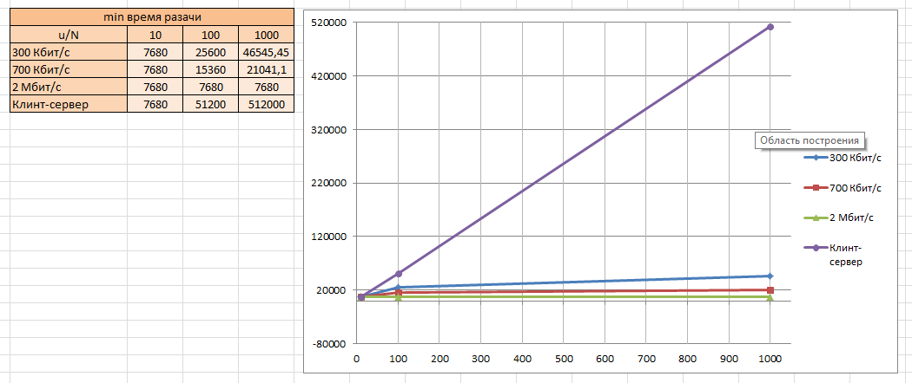

## Homework 5. ***Прикладной уровень***
## 2. Задачки
### Задача 1
Допустим, что $\{T_p}$ - время распространения сигнала (которая равна задержке распространения $\ d_p = d/S = T_p $). Так как известна скорость распространения, то $\{T_p}$ можно найти по формуле:

$$\ T_p = l / c = 10 / (300 * 10^6) = 0.033 \ \ мкс; $$

где $\{l}$ - длина линии связи - 10 м; $\{с}$ - скорость света - $\{300 * 10^6}$ м/с.

Общая задержка (сумма задержки распространения и передачи):

$$\ d = d_{распр} + d_{передачи}; $$

где $\ d_{передачи} = L/R; $

а) При параллельных непостоянных HTTP-соединениях пропускная способность $\{= 150/10 = 15}$ бит/с (так как загрузка параллельная на 10 независимых соединениях).

Сначала отправитель отправил запрос на сервер. Сервер его обработал, установил соединение, и отправил объект в ответ.

Требуемое время:

$$\ d = (200 * 3 / 150 + 100 000 / 150 + 4 * T_p) + (200 * 3 / 15 + 100 000 / 15 + 4 * T_p) = 7377.33 + 8 * T_p ≈ 7377.33 \ \ c. $$

б) При постоянных HTTP-соединений пропускная способность остается неизменной $\{= 150}$ бит/с:

$$\ d = (200 * 3 / 150 + 100 000 / 150 + 4 * T_p) + 10 * (200 / 150 + 100 000 / 150 + 2 * T_p) = 7350.66 + 24 * T_p ≈ 7350.66 \ \ c. $$

По сравнению с непостоянным соединением, улучшений нет, даже несколько хуже.

<ins>Ответ:</ins> а) $\ d ≈ 7377.33 \ \ c. $

а) $\ d ≈ 7350.66 \ \ c. $

### Задача 2
Размер файла $\ F = 15 \ \ Гбит = 15 * 1024 \ \ Мбит = 15360  \ \ Мбит. $

Необходимо посчитать минимальное время раздачи для клиент-серверной сети и одноранговой. Для это будем использовать следующие формулы.

Для клиент-серверной сети:

$$\ D_{кс} = max ( N * F/ u_s ; \ F / d_{min} ); $$

Для одноранговой:

$$\ D_{p2p} = max ( N * F/ (u_s + \sum_{i=1}^N{u_i}) ; \ F / d_{min} ; \ F / u_{s} ); $$

Сначала проведем расчёт для клиент-сервисной раздачи. Как видно из формулы, $\{ u_i }$ не используются при расчетах.

1. Для $\ N = 10; \ ( u = 300 \ \ Кбит/с;\ u = 700 \ \ Кбит/с;\ u = 2 \ \ Mбит/с) $

$$\ D_{кс} = max ( 10 * 15360 / 30 ; \ 15360 / 2 ) =  max ( 5120 ; \ 7680 ) = 7680 \ \ c. $$

2. Для $\ N = 100; \ ( u = 300 \ \ Кбит/с;\ u = 700 \ \ Кбит/с;\ u = 2 \ \ Mбит/с) $

$$\ D_{кс} = max ( 100 * 15360 / 30 ; \ 15360 / 2 ) =  max ( 51200 ; \ 7680 ) = 51200 \ \ c. $$

3. Для $\ N = 1000; \ ( u = 300 \ \ Кбит/с;\ u = 700 \ \ Кбит/с;\ u = 2 \ \ Mбит/с) $

$$\ D_{кс} = max ( 1000 * 15360 / 30 ; \ 15360 / 2 ) =  max ( 512000 ; \ 7680 ) = 512000 \ \ c. $$

Полученные результаты можно свести в таблицу.

| u/N        | 10       | 100       | 1000       |
| ---------- | :------: | :-------: | :--------: |
| 300 Кбит/с | 7680 сек | 51200 сек | 512000 сек |
| 700 Кбит/с | 7680 сек | 51200 сек | 512000 сек |
| 2 Мбит/с   | 7680 сек | 51200 сек | 512000 сек |

Теперь рассчитаем значения для одноранговой сети.

1. Для $\ N = 10; \ u = 300 \ \ Кбит/с = 0.3 \ \ Мбит/с. $

$$\ D_{p2p} = max ( 10 * 15360 / (30 + 0.3 * 10) ; \ 15360 / 2 ; \ 15360 / 30 ) = max ( 4654.55 ; \ 7680 ; \ 5120 ) = 7680 \ \ с. $$

2. Для $\ N = 100; \ u = 300 \ \ Кбит/с = 0.3 \ \ Мбит/с. $

$$\ D_{p2p} = max ( 100 * 15360 / (30 + 0.3 * 100) ; \ 15360 / 2 ; \ 15360 / 30 ) = max ( 25600 ; \ 7680 ; \ 5120 ) = 25600 \ \ с. $$

3. Для $\ N = 1000; \ u = 300 \ \ Кбит/с = 0.3 \ \ Мбит/с. $

$$\ D_{p2p} = max ( 1000 * 15360 / (30 + 0.3 * 1000) ; \ 15360 / 2 ; \ 15360 / 30 ) = max ( 46545.46 ; \ 7680 ; \ 5120 ) = 46545.46 \ \ с. $$

4. Для $\ N = 10; \ u = 700 \ \ Кбит/с = 0.7 \ \ Мбит/с. $

$$\ D_{p2p} = max ( 10 * 15360 / (30 + 0.7 * 10) ; \ 15360 / 2 ; \ 15360 / 30 ) = max ( 4151.35 ; \ 7680 ; \ 5120 ) = 7680 \ \ с. $$

5. Для $\ N = 100; \ u = 700 \ \ Кбит/с = 0.7 \ \ Мбит/с. $

$$\ D_{p2p} = max ( 100 * 15360 / (30 + 0.7 * 100) ; \ 15360 / 2 ; \ 15360 / 30 ) = max ( 15360 ; \ 7680 ; \ 5120 ) = 15360 \ \ с. $$

6. Для $\ N = 1000; \ u = 700 \ \ Кбит/с = 0.7 \ \ Мбит/с. $

$$\ D_{p2p} = max ( 1000 * 15360 / (30 + 0.7 * 1000) ; \ 15360 / 2 ; \ 15360 / 30 ) = max ( 21041.1 ; \ 7680 ; \ 5120 ) = 21041.1 \ \ с. $$

7. Для $\ N = 10; \ u = 2 \ \ Мбит/с. $

$$\ D_{p2p} = max ( 10 * 15360 / (30 + 2 * 10) ; \ 15360 / 2 ; \ 15360 / 30 ) = max ( 3072 ; \ 7680 ; \ 5120 ) = 7680 \ \ с. $$

8. Для $\ N = 100; \ u = 2 \ \ Мбит/с. $

$$\ D_{p2p} = max ( 100 * 15360 / (30 + 2 * 100) ; \ 15360 / 2 ; \ 15360 / 30 ) = max ( 6678.26 ; \ 7680 ; \ 5120 ) = 7680 \ \ с. $$

9. Для $\ N = 1000; \ u = 2 \ \ Мбит/с. $

$$\ D_{p2p} = max ( 1000 * 15360 / (30 + 2 * 1000) ; \ 15360 / 2 ; \ 15360 / 30 ) = max ( 7566.5 ; \ 7680 ; \ 5120 ) = 7680 \ \ с. $$

Полученные результаты отобразим в таблице:

| u/N        | 10       | 100       | 1000        |
| ---------- | :------: | :-------: | :---------: |
| 300 Кбит/с | 7680 сек | 25600 сек | 46545.5 сек |
| 700 Кбит/с | 7680 сек | 15360 сек | 21041.1 сек |
| 2 Мбит/с   | 7680 сек | 7680 сек  | 7680 сек    |

Из полученных значений построим график. Так как в клиент-серверной сети скорость не влияет на минимальное время раздачи, то строки одинаковы - запишем их как одну.

Как можно увидеть, с увеличением N увеличиывается также и время для полной передачи файла. В случаях, когда $\{ u_i }$ меньше $\{ d_{min} }$, тогда скорость становиться равномерной.

Соответственно, при одноранговой раздаче требуется меньше минимального времени, и с увеличением $\{N}$ график растет не так быстро. В отлчиие от клиент-сервисной сети, которая растет пропорционально $\{N}$.

### Задача 3
a. Допустим сервер отправляет файл каждому клиенту по параллельным каналам, со скоростью $\{u_s / N}$. Так как эта скорость меньше скорости загрузки каждого клиента ($\{u_s / N} ≤ d_{min} $), значит каждый клиент также может получать эти файлы только со скоростью $\{u_s / N}$. Поскольку каждый клиент получает файлы с такой скоростью, то общее время получения каждым клиентом всего файла будет равно $\{F / (u_s / N)} = N * F / u_s$. То есть все клиенты получают файл со скоростью $\ N * F / u_s$, общее время распространения также равно $\ N * F / u_s$.

б. Допустим серве отправляет файл каждому клиенту параллельно с определенной скоростью $\ d_{min} $. Причем совокупная скорость  $\{ N * d_{min} }$ меньше, чем скорость соединения сервера $\{ u_s }$ так как $\ {u_s / N} ≥ d_{min} $. Поскольку каждый клиент получает со скоростью $\ d_{min} $, то время, необходимое каждому клиенту для получения всего файла равно $\ F / d_{min} $. И раз все клиенты получают файл за это время, общее время распространения также равно $\ F / d_{min} $.

в. Мы знаем, что $\ D_{кс} ≥ max ( N * F/ u_s ; \ F / d_{min} ) $.

Предположим, что $\ {u_s / N} ≤ d_{min} $. Тогда из уровнения можно получить $\ {D_{кс} ≥ N * F/ u_s} $. Но из пункта (а) имеем $\ {D_{кс} ≤ N * F/ u_s} $, следовательно

$\ {D_{кс} = N * F/ u_s} $, когда $\ {u_s / N} ≤ d_{min} $

Также можно показать, что $\ {D_{кс} = F / d_{min}} $, когда $\ {u_s / N} ≥ d_{min} $

Если объединить последние два уравнения, как раз получим, что $\ D_{кс} ≥ max ( N * F/ u_s ; \ F / d_{min} ) $.
