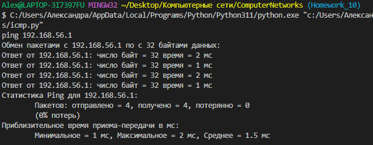

## Homework 11. Сетевой уровень
## 2. Программирование.
### 1. Эхо запросы через ICMP

Здесь реализована программа для ping запросов. Чтобы протестировать её необходимо склонировать эту ветку:

```git clone -b Homework_10 https://github.com/AlexPolarBear/ComputerNetworks.git```

Перейдите в склонированную папку и запустите программу

```python icmp.py```

Когда программа запуститься, появиться строка "ping " - введите нужный адрес.

Для наглядности, программа должна выглядить так:


