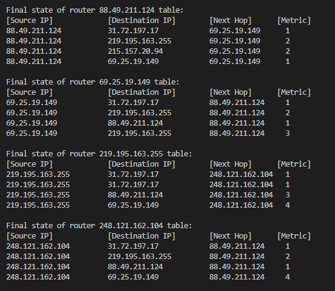

## Homework 12. Сетевой уровень
## 1. RIP

Здесь реализована эмулятор RIP-протокола. Чтобы протестировать её необходимо склонировать эту ветку:

```git clone -b Homework_11 https://github.com/AlexPolarBear/ComputerNetworks.git```

Перейдите в склонированную папку и запустите программу

```python RIP_protocol.py```

Программа сама генерирует ip-адреса.

Для наглядности, результаты выглядят так:


