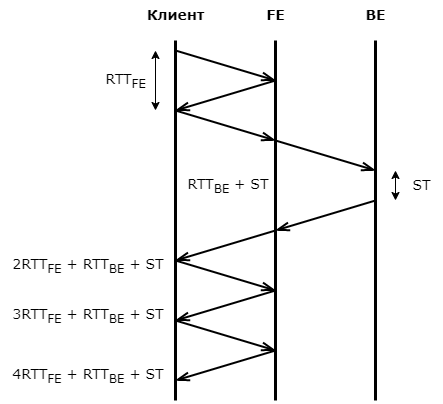
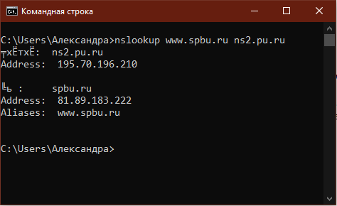

## Homework 4. ***Прикладной уровень***
## 2. Wireshark. Работы с DNS
### A. Утилита nslookup

• для корейского сайта nslookup English.visitkorea.or.kr (также отобразилось, что у него несколько ip-адресов).

• DNS-сервера для Барселонского университета nslookup -type=ns uab.cat.

• у wireshark.org имеется несколько ip-адресов, у сайта spbu.ru - только один ip-адрес.

### Б. DNS-трассировка www.ietf.org

• Используется UDP протокол.

• У первого dns запроса source port: 56334, destination port: 53. У второго запрос - наоборот source port: 53, destination port: 56334.

• Да, отличаются, запрос отправлен на ip-адрес 192.168.0.102, а адрес DNS 195.70.196.201.

• Запрашивается запись (Queries) типа www.ietf.org: type A, class IN, в которой указаны ограничения (Name: www.ietf.org, необходимая длина имени - [Name Length: 12], количество ответов - [Label Count: 3], Type: A (Host Address) (1), Class: IN (0x0001)).

• 3 ответа, которые отвечают требованиям первовго DNC запроса и с добавлением ip-адреса и времени жизни - www.ietf.org.cdn.cloudflare.net: type A, class IN, addr 104.16.44.99 (Name: www.ietf.org.cdn.cloudflare.net, type: A (Host Address) (1), Class: IN (0x0001), Time to live: 30 (30 seconds), Data length: 4, Address: 104.16.44.99).

• Да, ip-адрес соответствует адресу в ответе dns – 104.16.44.99.

• Да, выполняет.

### В. DNS-трассировка www.spbu.ru

• Порт назначения Destination Port: 50828, порт источника Source Port: 53.

• Да, совпадает ip-адрес равен адресу DNS сервера - 195.70.196.201.

• Запрашивается type A, (Queries) webstat.spbu.ru: type A, class IN, также аналогично предыдущей задаче, содержиться сколько должно быть ответов, какая длина сообщения, имени.

• 1 ответ, который содержит ответы на сообщение в запросе, также ip-адрес и time to liv (аналогично предыдущей задаче).

### Г. DNS-трассировка nslookup –type=NS

• На адрес 192.168.0.1. Да, совпадает с адресом локального DNS сервера.

• В запросе вызвали тип NS - имена хостов авторитетного DNS сервера. В запроске нет ответа.

• В ответном сообщение пишется имя и DNS сервера, на который пришел ответ. Затем "не заслуживающие доверия ответы" (неавторитетные ответы, которые пришли из кэша некоторого сервера), потом имена DNS серверов spbu.ru nameserver = ns.pu.ru и spbu.ru nameserver = ns2.pu.ru. И в ответе также пришли ip-адреса этих серверов ns.pu.ru: internet address = 195.70.196.219 и ns2.pu.ru: internet address = 195.70.196.210 (хотя nslookup явно их не просил).

### Д. DNS-трассировка nslookup www.spbu.ru ns2.pu.ru

• Запрос отправлен на сервер ns2.pu.ru с ip-адресом 195.70.196.210, не совпадает с адресом локального DNS сервера. Он принадлежит хосту spbu.ru 195.70.196.///

• В запросе указываем, что хотим отослать запрос не серверу по умолчанию, а конкретному серверу www.spbu.ru.

• 2 ответа, сначала пишется куда пришёл ответ (сервер ns2.pu.ru с ip-адресом 195.70.196.210). И сам ip-адрес хоста, который мы запрашиваем - 81.89.183.222

### Е. Сервисы whois

• Это база данных, в которой хранятся сведения о доменах. С помощью whois можно найти информацию о регистрации доменов, DNS серверах, ip-адресах

• 

 Используя различные сервисы whois в Интернете, получите имена любых двух DNSсеверов. Какие сервисы вы при этом использовали?
 Используйте команду nslookup на локальном хосте чтобы послать запросы трем серверам DNS: вашему локальному серверу DNS и двум DNS-серверам, найденным в предыдущей части.
