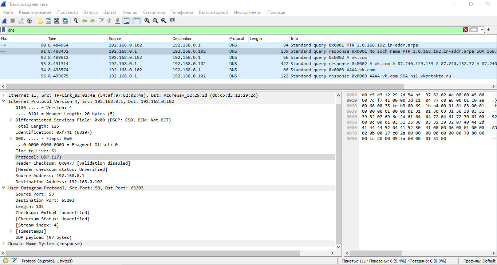
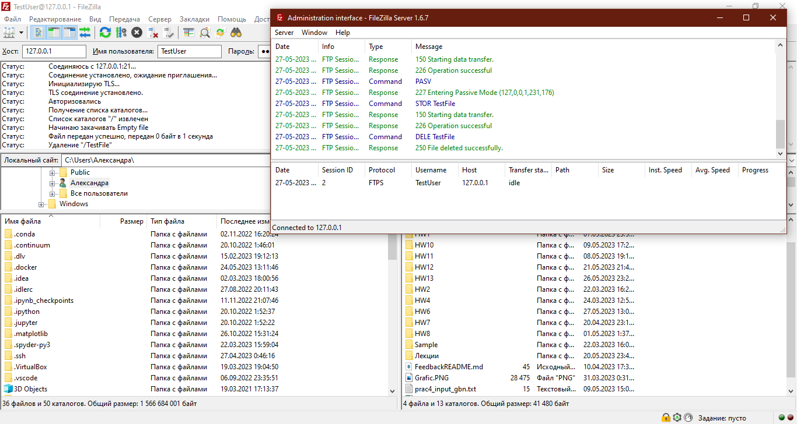

## Homework 6. Транспортный уровень

## 1. Wireshark: UDP



1. В заголовке UDP содержится 4 основных поля (Source Port, Destination Port, Length, Checksum);

2. Общая длина заголовка - 8 байт. Каждое поле занимает по 2 байт.

3. Длина, в данном случае 105 байт, - сумма 8 байт заголовка и оставшиеся (97 байт) данных, инкапсулированных в пакете.

4. Максимальное количество байт в полезной нагрузке составляет ${ 2^{16} }$ байт,  8 из которых уходит на заголовок. То есть, максимальное количество байт:

    $${ 2^{16} - 8 = 65535 - 8 = 65527. }$$

5. Максимально возможное значение номера порта отправителя - 65535 (${ 2^{16} }$).

6. В десятеричной системе, номер протокола UDP равен 17, в шестандцатеричной - 0х11.

7. Исходный порт, отправляющий запрос, является портом назначения получаемого сообщения. Наоборот, порт назначения для отправляемого сообщения также является портом источника для получаемого сообщения.

    Хост запроса:

    

    Хост ответа:

    

## 2. Программирование. FTP

### 1. FileZilla сервер и клиент

FTP сервер по адресу 127.0.0.1:21, пользователь TestUser.

Все работает и отображается:



### 2. FTP клиент

В файле client.py реализовано консольное приложение FTP-клиент.

```git clone -b Homework_6 https://github.com/AlexPolarBear/ComputerNetworks.git```

Перейдите в склонированную папку и запустите программу

```python client.py```

Когда программа запуститься, следуйте указаниям вывода в консоли. Первая команду следует использовать подключение - conn. Регистр букв не влияет на команды. Он подключается к созданному в предыдущем задании серверу: с данными 127.0.0.1:21, пользователь TestUser(по умолчанию), пароль 12345 (по умолчанию).
