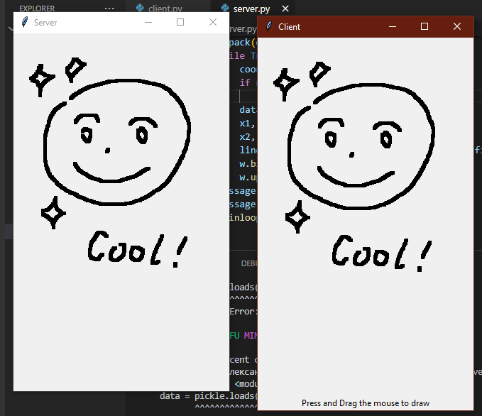

## 4. Удаленное рисование

Здесь реализована простенькая клиент-сервисная программа для удаленного рисования.

Для запуска понадобятся библиотеки: pickle and tkinter. Для их установки воспользуйтесь командой:

```python -m pip install pickle```

```python -m pip install tk```

Чтобы протестировать его:

1. Перейдите в склонированную папку .../ComputerNetworks/echo

    Для запуска откройте 2 окна терминала, в одном запустите сервер:

    ```python server.py```
    
    Он запустится и будет ждать подключения.

    Из второго запустите клиента:

    ```python client.py```

    В клиенте можно рисовать. Как только Вы начнёте рисовать, отобразиться окно сервера.

2. Чтобы закончить сеанс просто закройте окна.

Для наглядности, выглядить должно примерно вот так:


