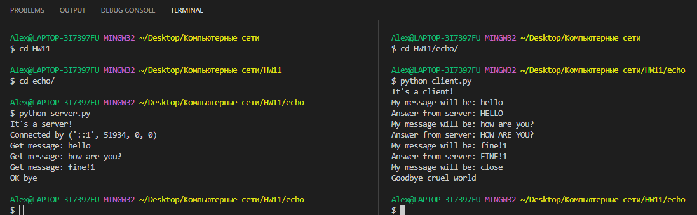

## 3.  Использование протокола IPv6

Здесь находится клиент-серверное приложение, реализующее эхо-запросы. Для отправки сообщений используется локальный IPv6 адрес.

Чтобы использовать его, необходимо:

1. Убедится что установлена необходимая библиотека:

    ```python -m pip show socket```

    Если выдается ошибка, установить библиотеку:

    ```python -m pip install socket```

2. Перейдите в склонированную папку .../ComputerNetworks/echo

    Для запуска откройте 2 окна терминала, в одном запустите сервер:

    ```python server.py```
    
    Он запуститься и будет ждать подключения.

    Из второго запустите клиента:

    ```python client.py```

    Сервер должен уведомить о подключении. Теперь с клиента можно писать.

3. Чтобы закончить сеанс, введите сообщение "close". Тогда клиент и сервер завершат работу.

Для наглядности, выглядить должно примерно вот так:


